# bootstrap_form

[](https://github.com/bootstrap-ruby/bootstrap_form/actions/workflows/ruby.yml)
[](https://rubygems.org/gems/bootstrap_form)

`bootstrap_form` is a Rails form builder that makes it super easy to integrate Bootstrap v5-style forms into your Rails application. It provides form helpers that augment the Rails form helpers. `bootstrap_forms`'s form helpers generate the form field and its label and all the Bootstrap mark-up required for proper Bootstrap display. `bootstrap_form` also provides:

* [Validation error messages](#validation-and-errors) below the field they correspond to, by default. You can also put the error messages after the label, or turn off `bootstrap_form`'s validation error handling and do it yourself. _Note that this applies to Rails-generated validation messages._ HTML 5 client-side validation and Rails validation out of the box don't really work well together. One discussion of the challenges and some solutions is [here](https://www.jorgemanrubia.com/2019/02/16/form-validations-with-html5-and-modern-rails/)
* Automatic [mark-up for the `required` attribute](#required-fields) on required fields.
* An easy way to consistently show [help](#help-text) text on fields.
* Mark-up for [Bootstrap horizontal forms](#horizontal-forms) (labels to the left of their fields, like a traditional desktop application), if that's what you want.
* Many [options](#form-helpers) to modify or augment the generated mark-up.
* A way to [escape to the Rails form helpers](#accessing-rails-form-helpers) if you need to do something that `bootstrap_form` can't do.

Some other nice things that `bootstrap_form` does for you are:

* Reduces the amount of code in your `.erb` files.
* Gets you going faster with Bootstrap, because you don't need to learn all the rules of Bootstrap form mark-up to get started.
* Reduces errors, because you're doing less typing.
* Makes it easier to see the logic of the form, because it's not mixed in with the Bootstrap mark-up.

`bootstrap_form` works like the standard Rails form helpers, and this README assumes you know how they work. You start a form with one of [`bootstrap_form_with`](#bootstrap-form-with), [`bootstrap_form_for`](#bootstrap-form-for), or [`bootstrap_form_tag`](#bootstrap-form-tag) in a view file. You get a form builder that calls the [`bootstrap_form` helpers](#form-helpers) instead of the standard Rails helpers. You use that form builder in the view file to render one or more form fields.

## Requirements

`bootstrap_form` supports at a minimum the currently supported versions of Ruby and Rails:

* Ruby 2.5+
* Rails 5.2+
* Bootstrap 5.0+

## Installation

Install Bootstrap 5. There are many ways to do this, depending on the asset pipeline you're using in your Rails application. One way is to use the gem that works with Sprockets. To do so, in a brand new Rails 7.0 application created _without_ the `--webpacker` option, add the `bootstrap` gem to your `Gemfile`:

```ruby
gem "bootstrap", "~> 5.0"
```

And follow the remaining instructions in the [official bootstrap installation guide](https://github.com/twbs/bootstrap-rubygem#a-ruby-on-rails) for setting up `application.scss` and `application.js`.

Add the `bootstrap_form` gem to your `Gemfile`:

```ruby
gem "bootstrap_form", "~> 5.1"
```

Then:

`bundle install`

Depending on which CSS pre-processor you are using, adding the bootstrap form styles differs slightly.
If you use Rails in the default mode without any pre-processor, you'll have to add the following line to your `application.css` file:

```css
*= require rails_bootstrap_forms
```

If you followed the [official bootstrap installation guide](https://github.com/twbs/bootstrap-rubygem#a-ruby-on-rails), you'll probably have switched to SCSS. In this case add the following line to your `application.scss`:

```scss
@import "rails_bootstrap_forms";
```

## Usage

### bootstrap_form_for

To get started, use the `bootstrap_form_for` helper in place of the Rails `form_for` helper. Here's an example:


```erb
<%= bootstrap_form_for(@user) do |f| %>
  <%= f.email_field :email %>
  <%= f.password_field :password %>
  <%= f.check_box :remember_me %>
  <%= f.submit "Log In" %>
<% end %>
```

This generates the following HTML:

```html
<form accept-charset="UTF-8" action="/users" class="new_user" id="new_user" method="post">
  <div class="mb-3">
    <label class="form-label required" for="user_email">Email</label>
    <input class="form-control" id="user_email" name="user[email]" type="email" value="steve@example.com">
  </div>
  <div class="mb-3">
    <label class="form-label" for="user_password">Password</label>
    <input class="form-control" id="user_password" name="user[password]" type="password">
  </div>
  <div class="form-check mb-3">
    <input autocomplete="off" name="user[remember_me]" type="hidden" value="0">
    <input class="form-check-input" id="user_remember_me" name="user[remember_me]" type="checkbox" value="1">
    <label class="form-check-label" for="user_remember_me">Remember me</label>
  </div>
  <input class="btn btn-secondary" data-disable-with="Log In" name="commit" type="submit" value="Log In">
</form>
```

### bootstrap_form_tag

If your form is not backed by a model, use the `bootstrap_form_tag`. Usage of this helper is the same as `bootstrap_form_for`, except no model object is passed in as the first argument. Here's an example:

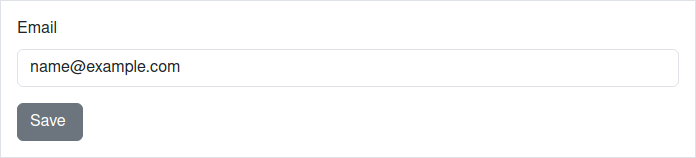
```erb
<%= bootstrap_form_tag url: '/subscribe' do |f| %>
  <%= f.email_field :email, value: 'name@example.com' %>
  <%= f.submit %>
<% end %>
```

This generates:

```html
<form accept-charset="UTF-8" action="/subscribe" method="post">
  <div class="mb-3">
    <label class="form-label" for="email">Email</label>
    <input class="form-control" id="email" name="email" type="email" value="name@example.com">
  </div>
  <input class="btn btn-secondary" data-disable-with="Save " name="commit" type="submit" value="Save ">
</form>
```

### bootstrap_form_with

Note that `form_with` in Rails 5.1 does not add IDs to form elements and labels by default, which are both important to Bootstrap markup. This behaviour is corrected in Rails 5.2.

To get started, just use the `bootstrap_form_with` helper in place of `form_with`. Here's an example:

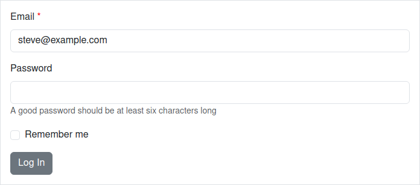
```erb
<%= bootstrap_form_with(model: @user, local: true) do |f| %>
  <%= f.email_field :email %>
  <%= f.password_field :password, help: 'A good password should be at least six characters long' %>
  <%= f.check_box :remember_me %>
  <%= f.submit "Log In" %>
<% end %>
```

This generates:

```html
<form accept-charset="UTF-8" action="/users" method="post">
  <div class="mb-3">
    <label class="form-label required" for="user_email">Email</label>
    <input class="form-control" id="user_email" name="user[email]" type="email" value="steve@example.com">
  </div>
  <div class="mb-3">
    <label class="form-label" for="user_password">Password</label>
    <input class="form-control" id="user_password" name="user[password]" type="password">
    <small class="form-text text-muted">A good password should be at least six characters long</small>
  </div>
  <div class="form-check mb-3">
    <input autocomplete="off" name="user[remember_me]" type="hidden" value="0">
    <input class="form-check-input" id="user_remember_me" name="user[remember_me]" type="checkbox" value="1">
    <label class="form-check-label" for="user_remember_me">Remember me</label>
  </div>
  <input class="btn btn-secondary" data-disable-with="Log In" name="commit" type="submit" value="Log In">
</form>
```

`bootstrap_form_with` supports both the `model:` and `url:` use cases
in `form_with`.

`form_with` has some important differences compared to `form_for` and `form_tag`, and these differences apply to `bootstrap_form_with`. A good summary of the differences can be found at: https://m.patrikonrails.com/rails-5-1s-form-with-vs-old-form-helpers-3a5f72a8c78a, or in the [Rails documentation](api.rubyonrails.org).

## Configuration

`bootstrap_form` can be used out-of-the-box without any configuration. However, `bootstrap_form` does have an optional configuration file at `config/initializers/bootstrap_form.rb` for setting options that affect all generated forms in an application.

The current configuration options are:

| Option | Default value | Description |
|---------------------------|------------------|-----------------------------------------------------------------------------------------------------------------------------------------------------------------------------------------------------------------------------------------------------------------------------------------------------|
| `default_form_attributes` | | `bootstrap_form` versions 3 and 4 added a role="form" attribute to all forms. The W3C validator will raise a **warning** on forms with a role="form" attribute. `bootstrap_form` version 5 drops this attribute by default. Set this option to `{ role: "form" }` to make forms non-compliant with W3C, but generate the `role="form"` attribute like `bootstrap_form` versions 3 and 4. |

Example:

```ruby
# config/initializers/bootstrap_form.rb
BootstrapForm.configure do |c|
  c.default_form_attributes = { role: "form" } # to make forms non-compliant with W3C.
end
```

## Form Helpers

`bootstrap_form` provides its own version of the following Rails form helpers:

```
button                   email_field                               search_field
check_box                file_field                                select
collection_check_boxes   grouped_collection_select                 submit
collection_radio_buttons hidden_field (not wrapped, but supported) telephone_field
collection_select        month_field                               text_area
color_field              number_field                              text_field
date_field               password_field                            time_field
date_select              phone_field                               time_select
datetime_field           radio_button                              time_zone_select
datetime_local_field     range_field                               url_field
datetime_select          rich_text_area (Rails 6+)                 week_field
```

By default, the helpers generate a `label` tag, and an `input`, `select`, or `textarea` tag, by calling the Rails `label` helper, and then the Rails helper with the same name as the `bootstrap_form` helper.

The `bootstrap_form` helpers accept the same options as the standard Rails form helpers, and pass those options through to the Rails helper. They also accept additional options, described in the following section.

## Form Helper Options

Many of the helpers accept the same options. The exceptions are:

[button](#submit-buttons),
[check_box](#checkboxes-and-radios),
[collection_check_boxes](#collections),
[collection_radio_buttons](#collections),
[collection_select](#selects),
[date_select](#date-helpers),
[datetime_select](#date-helpers),
[file_field](#file-fields),
[grouped_collection_select](#selects),
[hidden_field](#hidden-fields),
[radio_button](#checkboxes-and-radios),
[rich_text_area](#rich-text-areas-aka-trix-editor),
[select](#selects),
[submit](#submit-buttons),
[time_select](#date-helpers),
[time_zone_select](#selects)

The options for the form helpers that aren't in the exceptions list are described in the following sub-sections:

### Labels

Use the `label` option if you want to specify the field's label text:

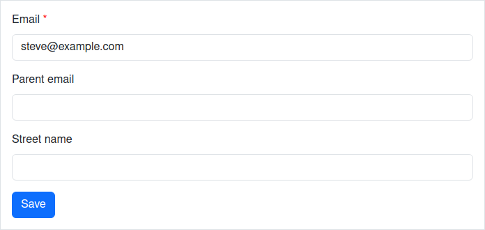
```erb
<%= f.password_field :password_confirmation, label: "Confirm Password" %>
```

This generates:

```html
<div class="mb-3">
  <label class="form-label" for="user_password_confirmation">Confirm Password</label>
  <input class="form-control" id="user_password_confirmation" name="user[password_confirmation]" type="password">
</div>
```

To hide a label, use the `hide_label: true` option. This adds the `visually-hidden`
class, which keeps your labels accessible to those using screen readers.

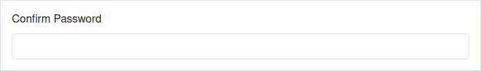
```erb
<%= f.text_area :comment, hide_label: true, placeholder: "Leave a comment..." %>
```

This generates:

```html
<div class="mb-3">
  <label class="form-label visually-hidden" for="user_comment">Comment</label>
  <textarea class="form-control" id="user_comment" name="user[comment]" placeholder="Leave a comment...">
</textarea>
</div>
```

To add custom classes to the field's label:

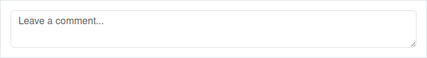
```erb
<%= f.text_field :email, label_class: "custom-class" %>
```

This generates:

```html
<div class="mb-3">
  <label class="form-label custom-class required" for="user_email">Email</label>
  <input class="form-control" id="user_email" name="user[email]" type="text" value="steve@example.com">
</div>
```

Or you can add the label as input placeholder instead (this automatically hides the label):

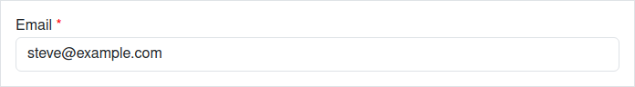
```erb
<%= f.text_field :email, label_as_placeholder: true %>
```

This generates:

```html
<div class="mb-3">
  <label class="form-label visually-hidden required" for="user_email">Email</label>
  <input class="form-control" id="user_email" name="user[email]" placeholder="Email" type="text" value="steve@example.com">
</div>
```

### Input Elements / Controls

To specify the class of the generated input tag, use the `control_class` option:

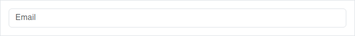
```erb
<%= f.text_field :email, control_class: "custom-class" %>
```

This generates:

```html
<div class="mb-3">
  <label class="form-label required" for="user_email">Email</label>
  <input class="custom-class" id="user_email" name="user[email]" type="text" value="steve@example.com">
</div>
```

### Help Text

To add help text, use the `help` option:


```erb
<%= f.password_field :password, help: "Must be at least 6 characters long" %>
```

This generates:

```html
<div class="mb-3">
  <label class="form-label" for="user_password">Password</label>
  <input class="form-control" id="user_password" name="user[password]" type="password">
  <small class="form-text text-muted">Must be at least 6 characters long</small>
</div>
```

This gem is also aware of help messages in locale translation files (i18n):

```yml
en:
  activerecord:
    help:
      user:
        password: "A good password should be at least six characters long"
```

Help translations containing HTML should follow the convention of appending `_html` to the name:

```yml
en:
  activerecord:
    help:
      user:
        password_html: "A <strong>good</strong> password should be at least six characters long"
```

If your model name has multiple words (like `SuperUser`), the key on the
translation file should be underscored (`super_user`).

You can override help translations for a particular field by passing the `help`
option or turn them off completely by passing `help: false`.

### Prepending and Appending Inputs

You can pass `prepend` and/or `append` options to input fields:

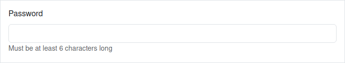
```erb
<%= f.text_field :price, prepend: "$", append: ".00" %>
```

This generates:

```html
<div class="mb-3">
  <label class="form-label" for="user_price">Price</label>
  <div class="input-group">
    <span class="input-group-text">$</span>
    <input class="form-control" id="user_price" name="user[price]" type="text">
    <span class="input-group-text">.00</span>
  </div>
</div>
```

If you want to attach multiple items to the input, pass them as an array:

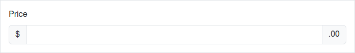
```erb
<%= f.text_field :price, prepend: ['Net', '$'], append: ['.00', 'per day'] %>
```

This generates:

```html
<div class="mb-3">
  <label class="form-label" for="user_price">Price</label>
  <div class="input-group">
    <span class="input-group-text">Net</span>
    <span class="input-group-text">$</span>
    <input class="form-control" id="user_price" name="user[price]" type="text">
    <span class="input-group-text">.00</span>
    <span class="input-group-text">per day</span>
  </div>
</div>
```

You can also prepend and append buttons. Note: The buttons must contain the
`btn` class to generate the correct markup.

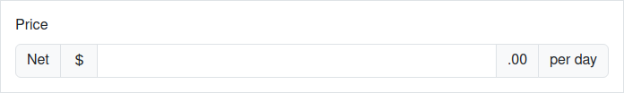
```erb
<%= f.text_field :search, append: link_to("Go", "#", class: "btn btn-secondary") %>
```

This generates:

```html
<div class="mb-3">
  <label class="form-label" for="user_search">Search</label>
  <div class="input-group">
    <input class="form-control" id="user_search" name="user[search]" type="text">
    <a class="btn btn-secondary" href="#">Go</a>
  </div>
</div>
```

To add a class to the input group wrapper, use the `:input_group_class` option.

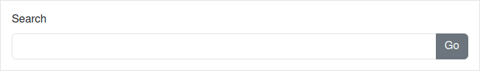
```erb
<%= f.email_field :email, append: f.primary('Subscribe'), input_group_class: 'input-group-lg' %>
```

This generates:

```html
<div class="mb-3">
  <label class="form-label required" for="user_email">Email</label>
  <div class="input-group input-group-lg">
    <input class="form-control" id="user_email" name="user[email]" type="email" value="steve@example.com">
    <input class="btn btn-primary" data-disable-with="Subscribe" name="commit" type="submit" value="Subscribe">
  </div>
</div>
```

### Additional Form Group Attributes

Bootstrap mark-up dictates that most input field types have the label and input wrapped in a `div.mb-3`.

If you want to change the CSS class or any other attribute to the form group div, you can use the `wrapper: { class: 'mb-3 additional-class', data: { foo: 'bar' } }` option.


```erb
<%= f.text_field :name, wrapper: { class: 'mb-3 has-warning', data: { foo: 'bar' } } %>
```

This generates:

```html
<div class="mb-3 has-warning" data-foo="bar">
  <label class="form-label" for="user_name">Name</label>
  <input class="form-control" id="user_name" name="user[name]" type="text">
</div>
```

Which produces the following output:

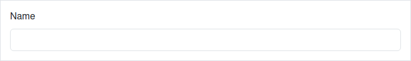
```erb
<div class="mb-3 has-warning" data-foo="bar">
  <label class="form-label form-control-label" for="user_name">Id</label>
  <input class="form-control" id="user_name" name="user[name]" type="text">
</div>
```

This generates:

```html
<div class="mb-3 has-warning" data-foo="bar">
  <label class="form-label form-control-label" for="user_name">Id</label>
  <input class="form-control" id="user_name" name="user[name]" type="text">
</div>
```

If you only want to set the class on the form group div, you can use the `wrapper_class` option: `wrapper_class: 'mb-3 additional-class'`.
It's just a short form of `wrapper: { class: 'mb-3 additional-class' }`.

If you don't want any class on the form group div, you can set it to `false`: `wrapper_class: false`.

### Suppressing the Form Group Altogether

You may want to define your own form group div around a field. To do so, add the option `wrapper: false` to the input field. For example:


```erb
<%= f.form_group :user do %>
  <%= f.email_field :email, wrapper: false %>
<% end %>
```

Generated HTML:

```html
<div class="mb-3">
  <input class="form-control" id="user_email" name="user[email]" type="email" value="steve@example.com">
</div>
```

Note that Bootstrap relies on the form group div to correctly format most fields, so if you use the `wrapper: false` option, you should provide your own form group div around the input field. You can write your own HTML, or use the `form_group` helper.

## Selects

Our select helper accepts the same arguments as the [default Rails helper](http://api.rubyonrails.org/classes/ActionView/Helpers/FormOptionsHelper.html#method-i-select). Here's an example of how you pass both options and html_options hashes:


```erb
<%= f.select :product, [["Apple", 1], ["Grape", 2]], { label: "Choose your favorite fruit:", wrapper: { class: 'has-warning', data: { foo: 'bar' } } }, { class: "selectpicker" } %>
```

This generates:

```html
<div class="has-warning" data-foo="bar">
  <label class="form-label" for="user_product">Choose your favorite fruit:</label>
  <select class="form-select selectpicker" id="user_product" name="user[product]">
    <option value="1">Apple</option>
    <option value="2">Grape</option>
  </select>
</div>
```

## Checkboxes and Radios

Checkboxes and radios should be placed inside of a `form_group` to render
properly. The following example ensures that the entire form group will display
an error if an associated validations fails:

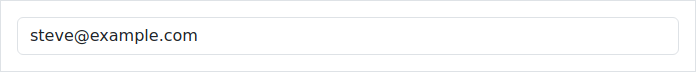
```erb
<%= f.form_group :skill_level, label: { text: "Skill" }, help: "Optional Help Text" do %>
  <%= f.radio_button :skill_level, 0, label: "Novice", checked: true %>
  <%= f.radio_button :skill_level, 1, label: "Intermediate" %>
  <%= f.radio_button :skill_level, 2, label: "Advanced" %>
<% end %>

<%= f.form_group :terms do %>
  <%= f.check_box :terms, label: "I agree to the Terms of Service" %>
<% end %>
```

This generates:

```html
<div class="mb-3">
  <label class="form-label" for="user_skill_level">Skill</label>
  <div class="form-check">
    <input checked class="form-check-input" id="user_skill_level_0" name="user[skill_level]" type="radio" value="0">
    <label class="form-check-label" for="user_skill_level_0">Novice</label>
  </div>
  <div class="form-check">
    <input class="form-check-input" id="user_skill_level_1" name="user[skill_level]" type="radio" value="1">
    <label class="form-check-label" for="user_skill_level_1">Intermediate</label>
  </div>
  <div class="form-check">
    <input class="form-check-input" id="user_skill_level_2" name="user[skill_level]" type="radio" value="2">
    <label class="form-check-label" for="user_skill_level_2">Advanced</label>
  </div>
  <small class="form-text text-muted">Optional Help Text</small>
</div>
<div class="mb-3">
  <div class="form-check mb-3">
    <input autocomplete="off" name="user[terms]" type="hidden" value="0">
    <input class="form-check-input" id="user_terms" name="user[terms]" type="checkbox" value="1">
    <label class="form-check-label" for="user_terms">I agree to the Terms of Service</label>
  </div>
</div>
```

You can also create a checkbox using a block:

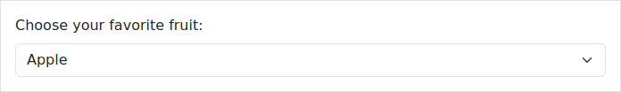
```erb
<%= f.form_group :terms, label: { text: "Optional Label" } do %>
  <%= f.check_box :terms do %>
    You need to check this box to accept our terms of service and privacy policy
  <% end %>
<% end %>
```

This generates:

```html
<div class="mb-3">
  <label class="form-label" for="user_terms">Optional Label</label>
  <div class="form-check mb-3">
    <input autocomplete="off" name="user[terms]" type="hidden" value="0">
    <input class="form-check-input" id="user_terms" name="user[terms]" type="checkbox" value="1">
    <label class="form-check-label" for="user_terms">
      You need to check this box to accept our terms of service and privacy policy
    </label>
  </div>
</div>
```

To display checkboxes and radios inline, pass the `inline: true` option:


```erb
<%= f.form_group :skill_level, label: { text: "Skill" } do %>
  <%= f.radio_button :skill_level, 0, label: "Novice", inline: true %>
  <%= f.radio_button :skill_level, 1, label: "Intermediate", inline: true %>
  <%= f.radio_button :skill_level, 2, label: "Advanced", inline: true %>
<% end %>
```

This generates:

```html
<div class="mb-3">
  <label class="form-label" for="user_skill_level">Skill</label>
  <div class="form-check form-check-inline">
    <input class="form-check-input" id="user_skill_level_0" name="user[skill_level]" type="radio" value="0">
    <label class="form-check-label" for="user_skill_level_0">Novice</label>
  </div>
  <div class="form-check form-check-inline">
    <input class="form-check-input" id="user_skill_level_1" name="user[skill_level]" type="radio" value="1">
    <label class="form-check-label" for="user_skill_level_1">Intermediate</label>
  </div>
  <div class="form-check form-check-inline">
    <input class="form-check-input" id="user_skill_level_2" name="user[skill_level]" type="radio" value="2">
    <label class="form-check-label" for="user_skill_level_2">Advanced</label>
  </div>
</div>
```

Check boxes and radio buttons are wrapped in a `div.form-check`. You can add classes to this `div` with the `:wrapper_class` option:

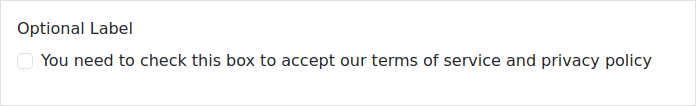
```erb
<%= f.radio_button :skill_level, 0, label: "Novice", inline: true, wrapper_class: "w-auto" %>
```

This generates:

```html
<div class="form-check form-check-inline w-auto">
  <input class="form-check-input" id="user_skill_level_0" name="user[skill_level]" type="radio" value="0">
  <label class="form-check-label" for="user_skill_level_0">Novice</label>
</div>
```

You can also add a style to the tag using the `wrapper` option:


```erb
<%= f.check_box :skilled, inline: true, wrapper: {style: "color: green"} %>
<%= f.radio_button :skill_level, 0, label: "Novice", inline: true, wrapper: {class: 'w-auto', style: "color: red"} %>
```

This generates:

```html
<div class="form-check form-check-inline mb-3" style="color: green">
  <input autocomplete="off" name="user[skilled]" type="hidden" value="0">
  <input class="form-check-input" id="user_skilled" name="user[skilled]" type="checkbox" value="1">
  <label class="form-check-label" for="user_skilled">Skilled</label>
</div>
<div class="form-check form-check-inline w-auto" style="color: red">
  <input class="form-check-input" id="user_skill_level_0" name="user[skill_level]" type="radio" value="0">
  <label class="form-check-label" for="user_skill_level_0">Novice</label>
</div>
```

### Switches

To render checkboxes as switches with Bootstrap 4.2+, use `switch: true`:

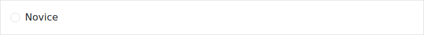
```erb
<%= f.check_box :remember_me, switch: true %>
```

This generates:

```html
<div class="form-check mb-3 form-switch">
  <input autocomplete="off" name="user[remember_me]" type="hidden" value="0">
  <input class="form-check-input" id="user_remember_me" name="user[remember_me]" type="checkbox" value="1">
  <label class="form-check-label" for="user_remember_me">Remember me</label>
</div>
```

### Collections

`bootstrap_form` also provides helpers that automatically create the
`form_group` and the `radio_button`s or `check_box`es for you:


```erb
<%= f.collection_radio_buttons :skill_level, Skill.all, :id, :name %>
<%= f.collection_check_boxes :skills, Skill.all, :id, :name %>
```

This generates:

```html
<div class="mb-3">
  <label class="form-label" for="user_skill_level">Skill level</label>
  <div class="form-check">
    <input class="form-check-input" id="user_skill_level_1" name="user[skill_level]" type="radio" value="1">
    <label class="form-check-label" for="user_skill_level_1">Mind reading</label>
  </div>
  <div class="form-check">
    <input class="form-check-input" id="user_skill_level_2" name="user[skill_level]" type="radio" value="2">
    <label class="form-check-label" for="user_skill_level_2">Farming</label>
  </div>
</div>
<input autocomplete="off" id="user_skills" multiple name="user[skills][]" type="hidden" value="">
<div class="mb-3">
  <label class="form-label" for="user_skills">Skills</label>
  <div class="form-check">
    <input class="form-check-input" id="user_skills_1" name="user[skills][]" type="checkbox" value="1">
    <label class="form-check-label" for="user_skills_1">Mind reading</label>
  </div>
  <div class="form-check">
    <input class="form-check-input" id="user_skills_2" name="user[skills][]" type="checkbox" value="2">
    <label class="form-check-label" for="user_skills_2">Farming</label>
  </div>
</div>
```

NOTE: These helpers do not currently support a block, unlike their equivalent Rails helpers. See issue [#477](https://github.com/bootstrap-ruby/bootstrap_form/issues/477). If you need to use the block syntax, use `collection_check_boxes_without_bootstrap` or `collection_radio_buttons_without_bootstrap` for now.

Collection methods accept these options:

* `:label`: Customize the `form_group`'s label
* `:hide_label`: Pass true to hide the `form_group`'s label
* `:help`: Add a help span to the `form_group`
* Other options will be forwarded to the `radio_button`/`check_box` method

## Range Controls

You can create a range control like this:

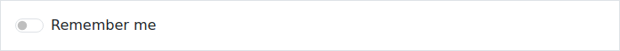
```erb
<%= f.range_field :excellence %>
```

This generates:

```html
<div class="mb-3">
  <label class="form-label" for="user_excellence">Excellence</label>
  <input class="form-control" id="user_excellence" name="user[excellence]" type="range">
</div>
```

## Static Controls

You can create a static control like this:


```erb
<%= f.static_control :email %>
```

This generates:

```html
<div class="mb-3">
  <label class="form-label required" for="user_email">Email</label>
  <input class="form-control-plaintext" id="user_email" name="user[email]" readonly type="text" value="steve@example.com">
</div>
```

Here's the output for a horizontal layout:

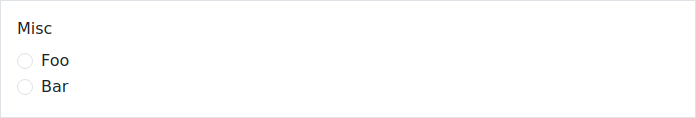
```erb
<%= bootstrap_form_for(@user, layout: :horizontal) do |f| %>
  <%= f.static_control :email %>
<% end %>
```

This generates:

```html
<form accept-charset="UTF-8" action="/users" class="new_user" id="new_user" method="post">
  <div class="mb-3 row">
    <label class="form-label col-form-label col-sm-2 required" for="user_email">Email</label>
    <div class="col-sm-10">
      <input class="form-control-plaintext" id="user_email" name="user[email]" readonly type="text" value="steve@example.com">
    </div>
  </div>
</form>
```

You can also create a static control that isn't based on a model attribute:

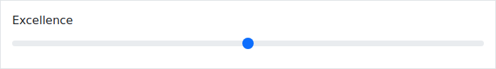
```erb
<%= f.static_control :field_name, label: "Custom Static Control", value: "Content Here" %>
```

This generates:

```html
<div class="mb-3">
  <label class="form-label" for="user_field_name">Custom Static Control</label>
  <input class="form-control-plaintext" id="user_field_name" name="user[field_name]" readonly type="text" value="Content Here">
</div>
```

`field_name` may be any name that isn't already used in the form. Note that you may get "unpermitted parameter" messages in your log file with this approach.

You can also create the static control the following way, if you don't need to get the value of the static control as a parameter when the form is submitted:


```erb
<%= f.static_control label: "Custom Static Control", value: "Content Here", name: nil %>
```

This generates:

```html
<div class="mb-3">
  <label class="form-label" for="user_">Custom Static Control</label>
  <input class="form-control-plaintext" id="user_" readonly type="text" value="Content Here">
</div>
```

(If you neither provide a field name nor `name: nil`, the Rails code that submits the form will give a JavaScript error.)

Prior to version 4 of `bootstrap_form`, you could pass a block to the `static_control` method.
The value of the block would be used for the content of the static "control".
Bootstrap 4 actually creates and styles a disabled input field for static controls, so the value of the control has to be specified by the `value:` option.
Passing a block to `static_control` no longer has any effect.

## Date Helpers

The multiple selects that the date and time helpers (`date_select`,
`time_select`, `datetime_select`) generate are wrapped inside a
`div.rails-bootstrap-forms-[date|time|datetime]-select` tag. This is because
Bootstrap automatically styles our controls as `block`s. This wrapper fixes
this defining these selects as `inline-block` and a width of `auto`.

## Submit Buttons

The `btn btn-secondary` CSS classes are automatically added to your submit
buttons.


```erb
<%= f.submit %>
```

This generates:

```html
<input class="btn btn-secondary" data-disable-with="Create User" name="commit" type="submit" value="Create User">
```

You can also use the `primary` helper, which adds `btn btn-primary` to your
submit button:

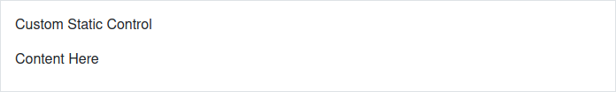
```erb
<%= f.primary "Optional Label" %>
```

This generates:

```html
<input class="btn btn-primary" data-disable-with="Optional Label" name="commit" type="submit" value="Optional Label">
```

You can specify your own classes like this:


```erb
<%= f.submit "Log In", class: "btn btn-success" %>
```

This generates:

```html
<input class="btn btn-success" data-disable-with="Log In" name="commit" type="submit" value="Log In">
```

If the `primary` helper receives a `render_as_button: true` option or a block,
it will be rendered as an HTML button, instead of an input tag. This allows you
to specify HTML content and styling for your buttons (such as adding
illustrative icons to them). For example, the following statements


```erb
<%= f.primary "Save changes <span class='fa fa-save'></span>".html_safe, render_as_button: true %>

<%= f.primary do
      concat 'Save changes '
      concat content_tag(:span, nil, class: 'fa fa-save')
    end %>
```

This generates:

```html
<button class="btn btn-primary" name="button" type="submit">Save changes <span class="fa fa-save">
  </span>
</button>
<button class="btn btn-primary" name="button" type="submit">Save changes <span class="fa fa-save">
  </span>
</button>
```

are equivalent, and each of them both be rendered as:

```html
<button name="button" type="submit" class="btn btn-primary">Save changes <span class="fa fa-save"></span></button>
```

If you wish to add additional CSS classes to your button, while keeping the
default ones, you can use the `extra_class` option. This is particularly useful
for adding extra details to buttons (without forcing you to repeat the
Bootstrap classes), or for element targeting via CSS classes.
Be aware, however, that using the `class` option will discard any extra classes
you add. As an example, the following button declarations


```erb
<%= f.primary "My Nice Button", extra_class: 'my-button' %>

<%= f.primary "My Button", class: 'my-button' %>
```

will be rendered as

```html
<input class="btn btn-primary my-button" data-disable-with="My Nice Button" name="commit" type="submit" value="My Nice Button">
<input class="my-button" data-disable-with="My Button" name="commit" type="submit" value="My Button">
```

(some unimportant HTML attributes have been removed for simplicity)

## Rich Text Areas AKA Trix Editor

If you're using Rails 6, `bootstrap_form` supports the `rich_text_area` helper.


```erb
<%= f.rich_text_area(:life_story) %>
```

will be rendered as:

```html
<div class="mb-3">
  <label class="form-label" for="user_life_story">Life story</label>
  <input autocomplete="off" id="user_life_story_trix_input_user" name="user[life_story]" type="hidden">
  <trix-toolbar id="trix-toolbar-1">
    <div class="trix-button-row">
      <span class="trix-button-group trix-button-group--text-tools" data-trix-button-group="text-tools">
        <button class="trix-button trix-button--icon trix-button--icon-bold" data-trix-attribute="bold" data-trix-key="b" tabindex="-1" title="Bold" type="button">Bold</button>
        <button class="trix-button trix-button--icon trix-button--icon-italic" data-trix-attribute="italic" data-trix-key="i" tabindex="-1" title="Italic" type="button">Italic</button>
        <button class="trix-button trix-button--icon trix-button--icon-strike" data-trix-attribute="strike" tabindex="-1" title="Strikethrough" type="button">Strikethrough</button>
        <button class="trix-button trix-button--icon trix-button--icon-link" data-trix-action="link" data-trix-attribute="href" data-trix-key="k" tabindex="-1" title="Link" type="button">Link</button>
      </span>
      <span class="trix-button-group trix-button-group--block-tools" data-trix-button-group="block-tools">
        <button class="trix-button trix-button--icon trix-button--icon-heading-1" data-trix-attribute="heading1" tabindex="-1" title="Heading" type="button">Heading</button>
        <button class="trix-button trix-button--icon trix-button--icon-quote" data-trix-attribute="quote" tabindex="-1" title="Quote" type="button">Quote</button>
        <button class="trix-button trix-button--icon trix-button--icon-code" data-trix-attribute="code" tabindex="-1" title="Code" type="button">Code</button>
        <button class="trix-button trix-button--icon trix-button--icon-bullet-list" data-trix-attribute="bullet" tabindex="-1" title="Bullets" type="button">Bullets</button>
        <button class="trix-button trix-button--icon trix-button--icon-number-list" data-trix-attribute="number" tabindex="-1" title="Numbers" type="button">Numbers</button>
        <button class="trix-button trix-button--icon trix-button--icon-decrease-nesting-level" data-trix-action="decreaseNestingLevel" tabindex="-1" title="Decrease Level" type="button">Decrease Level</button>
        <button class="trix-button trix-button--icon trix-button--icon-increase-nesting-level" data-trix-action="increaseNestingLevel" tabindex="-1" title="Increase Level" type="button">Increase Level</button>
      </span>
      <span class="trix-button-group trix-button-group--file-tools" data-trix-button-group="file-tools">
        <button class="trix-button trix-button--icon trix-button--icon-attach" data-trix-action="attachFiles" tabindex="-1" title="Attach Files" type="button">Attach Files</button>
      </span>
      <span class="trix-button-group-spacer">
      </span>
      <span class="trix-button-group trix-button-group--history-tools" data-trix-button-group="history-tools">
        <button class="trix-button trix-button--icon trix-button--icon-undo" data-trix-action="undo" data-trix-key="z" tabindex="-1" title="Undo" type="button">Undo</button>
        <button class="trix-button trix-button--icon trix-button--icon-redo" data-trix-action="redo" data-trix-key="shift+z" tabindex="-1" title="Redo" type="button">Redo</button>
      </span>
    </div>
    <div class="trix-dialogs" data-trix-dialogs="">
      <div class="trix-dialog trix-dialog--link" data-trix-dialog="href" data-trix-dialog-attribute="href">
        <div class="trix-dialog__link-fields">
          <input aria-label="URL" class="trix-input trix-input--dialog" data-trix-input="" disabled name="href" placeholder="Enter a URL…" required="" type="url">
          <div class="trix-button-group">
            <input class="trix-button trix-button--dialog" data-trix-method="setAttribute" type="button" value="Link">
            <input class="trix-button trix-button--dialog" data-trix-method="removeAttribute" type="button" value="Unlink">
          </div>
        </div>
      </div>
    </div>
  </trix-toolbar>
  <trix-editor aria-label="Life story" class="trix-content form-control" contenteditable="" data-blob-url-template="http://test.host/rails/active_storage/blobs/redirect/:signed_id/:filename" data-direct-upload-url="http://test.host/rails/active_storage/direct_uploads" id="user_life_story" input="user_life_story_trix_input_user" role="textbox" toolbar="trix-toolbar-1" trix-id="1">
  </trix-editor>
</div>
```

## File Fields

The `file_field` helper generates mark-up for a Bootstrap 4 custom file field entry. It takes the [options for `text_field`](#form-helper-options), minus `append` and `prepend`.

## Hidden Fields

The `hidden_field` helper in `bootstrap_form` calls the Rails helper directly, and does no additional mark-up.

## Accessing Rails Form Helpers

If you want to use the original Rails form helpers for a particular field,
append `_without_bootstrap` to the helper:


```erb
<%= f.text_field_without_bootstrap :email %>
```

This generates:

```html
<input id="user_email" name="user[email]" type="text" value="steve@example.com">
```

## Form Styles

By default, your forms will stack labels on top of controls and your controls
will grow to 100 percent of the available width. This is consistent with Bootstrap's "mobile first" approach.

### Inline Forms

To use an inline-layout form, use the `layout: :inline` option. To hide labels,
use the `hide_label: true` option, which keeps your labels accessible to those
using screen readers.


```erb
<%= bootstrap_form_for(@user, layout: :inline) do |f| %>
  <%= f.email_field :email, hide_label: true %>
  <%= f.password_field :password, hide_label: true %>
  <%= f.check_box :remember_me %>
  <%= f.submit %>
<% end %>
```

This generates:

```html
<form accept-charset="UTF-8" action="/users" class="new_user row row-cols-auto g-3 align-items-center" id="new_user" method="post">
  <div class="col">
    <label class="form-label visually-hidden mr-sm-2 required" for="user_email">Email</label>
    <input class="form-control" id="user_email" name="user[email]" type="email" value="steve@example.com">
  </div>
  <div class="col">
    <label class="form-label visually-hidden mr-sm-2" for="user_password">Password</label>
    <input class="form-control" id="user_password" name="user[password]" type="password">
  </div>
  <div class="form-check form-check-inline mb-3">
    <input autocomplete="off" name="user[remember_me]" type="hidden" value="0">
    <input class="form-check-input" id="user_remember_me" name="user[remember_me]" type="checkbox" value="1">
    <label class="form-check-label" for="user_remember_me">Remember me</label>
  </div>
  <div class="col">
    <input class="btn btn-secondary" data-disable-with="Create User" name="commit" type="submit" value="Create User">
  </div>
</form>
```

To skip label rendering at all, use `skip_label: true` option.

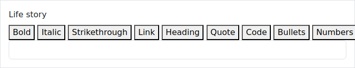
```erb
<%= f.password_field :password, skip_label: true %>
```

This generates:

```html
<div class="mb-3">
  <input class="form-control" id="user_password" name="user[password]" type="password">
</div>
```

### Horizontal Forms

To use a horizontal-layout form with labels to the left of the control, use the
`layout: :horizontal` option. You should specify both `label_col` and
`control_col` css classes as well (they default to `col-sm-2` and `col-sm-10`).

In the example below, the checkbox and submit button have been wrapped in a
`form_group` to keep them properly aligned.

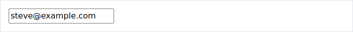
```erb
<%= bootstrap_form_for(@user, layout: :horizontal, label_col: "col-sm-2", control_col: "col-sm-10") do |f| %>
  <%= f.email_field :email %>
  <%= f.password_field :password %>
  <%= f.form_group do %>
    <%= f.check_box :remember_me %>
  <% end %>
  <%= f.form_group do %>
    <%= f.submit %>
  <% end %>
<% end %>
```

This generates:

```html
<form accept-charset="UTF-8" action="/users" class="new_user" id="new_user" method="post">
  <div class="mb-3 row">
    <label class="form-label col-form-label col-sm-2 required" for="user_email">Email</label>
    <div class="col-sm-10">
      <input class="form-control" id="user_email" name="user[email]" type="email" value="steve@example.com">
    </div>
  </div>
  <div class="mb-3 row">
    <label class="form-label col-form-label col-sm-2" for="user_password">Password</label>
    <div class="col-sm-10">
      <input class="form-control" id="user_password" name="user[password]" type="password">
    </div>
  </div>
  <div class="mb-3 row">
    <div class="col-sm-10 offset-sm-2">
      <div class="form-check">
        <input autocomplete="off" name="user[remember_me]" type="hidden" value="0">
        <input class="form-check-input" id="user_remember_me" name="user[remember_me]" type="checkbox" value="1">
        <label class="form-check-label" for="user_remember_me">Remember me</label>
      </div>
    </div>
  </div>

  <div class="mb-3 row">
    <div class="col-sm-10 offset-sm-2">
      <input class="btn btn-secondary" data-disable-with="Create User" name="commit" type="submit" value="Create User">
    </div>
  </div>
</form>
```

The `label_col` and `control_col` css classes can also be changed per control:


```erb
<%= bootstrap_form_for(@user, layout: :horizontal) do |f| %>
  <%= f.email_field :email %>
  <%= f.text_field :age, control_col: "col-sm-3" %>
  <%= f.form_group do %>
    <%= f.submit %>
  <% end %>
<% end %>
```

This generates:

```html
<form accept-charset="UTF-8" action="/users" class="new_user" id="new_user" method="post">
  <div class="mb-3 row">
    <label class="form-label col-form-label col-sm-2 required" for="user_email">Email</label>
    <div class="col-sm-10">
      <input class="form-control" id="user_email" name="user[email]" type="email" value="steve@example.com">
    </div>
  </div>
  <div class="mb-3 row">
    <label class="form-label col-form-label col-sm-2" for="user_age">Age</label>
    <div class="col-sm-3">
      <input class="form-control" id="user_age" name="user[age]" type="text" value="42">
    </div>
  </div>
  <div class="mb-3 row">
    <div class="col-sm-10 offset-sm-2">
      <input class="btn btn-secondary" data-disable-with="Create User" name="commit" type="submit" value="Create User">
    </div>
  </div>
</form>
```

or default value can be changed in initializer:

```ruby
# config/initializers/bootstrap_form.rb
module BootstrapForm
  class FormBuilder
    def default_label_col
      'col-sm-4'
    end
    def default_control_col
      'col-sm-8'
    end
    def default_layout
      # :default, :horizontal or :inline
      :horizontal
    end
  end
end
```

Control col wrapper class can be modified with `add_control_col_class`. This option will preserve column definition:

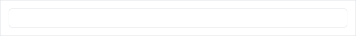
```erb
<%= bootstrap_form_for(@user, layout: :horizontal) do |f| %>
  <%= f.email_field :email %>
  <%= f.text_field :age, add_control_col_class: "additional-control-col-class" %>
  <%= f.form_group do %>
    <%= f.submit %>
  <% end %>
<% end %>
```

This generates:

```html
<form accept-charset="UTF-8" action="/users" class="new_user" id="new_user" method="post">
  <div class="mb-3 row">
    <label class="form-label col-form-label col-sm-2 required" for="user_email">Email</label>
    <div class="col-sm-10">
      <input class="form-control" id="user_email" name="user[email]" type="email" value="steve@example.com">
    </div>
  </div>
  <div class="mb-3 row">
    <label class="form-label col-form-label col-sm-2" for="user_age">Age</label>
    <div class="col-sm-10 additional-control-col-class">
      <input class="form-control" id="user_age" name="user[age]" type="text" value="42">
    </div>
  </div>
  <div class="mb-3 row">
    <div class="col-sm-10 offset-sm-2">
      <input class="btn btn-secondary" data-disable-with="Create User" name="commit" type="submit" value="Create User">
    </div>
  </div>
</form>
```

### Custom Field Layout

The form-level `layout` can be overridden per field, unless the form-level layout was `inline`:


```erb
<%= bootstrap_form_for(@user, layout: :horizontal) do |f| %>
  <%= f.email_field :email %>
  <%= f.text_field :feet, layout: :default %>
  <%= f.text_field :inches, layout: :default %>
  <%= f.form_group do %>
    <%= f.submit %>
  <% end %>
<% end %>
```

This generates:

```html
<form accept-charset="UTF-8" action="/users" class="new_user" id="new_user" method="post">
  <div class="mb-3 row">
    <label class="form-label col-form-label col-sm-2 required" for="user_email">Email</label>
    <div class="col-sm-10">
      <input class="form-control" id="user_email" name="user[email]" type="email" value="steve@example.com">
    </div>
  </div>
  <div class="mb-3">
    <label class="form-label" for="user_feet">Feet</label>
    <input class="form-control" id="user_feet" name="user[feet]" type="text" value="5">
  </div>
  <div class="mb-3">
    <label class="form-label" for="user_inches">Inches</label>
    <input class="form-control" id="user_inches" name="user[inches]" type="text" value="7">
  </div>
  <div class="mb-3 row">
    <div class="col-sm-10 offset-sm-2">
      <input class="btn btn-secondary" data-disable-with="Create User" name="commit" type="submit" value="Create User">
    </div>
  </div>
</form>
```

A form-level `layout: :inline` can't be overridden because of the way Bootstrap 4 implements in-line layouts. One possible work-around is to leave the form-level layout as default, and specify the individual fields as `layout: :inline`, except for the fields(s) that should be other than in-line.

### Custom Form Element Styles

The `custom` option can be used to replace the browser default styles for check boxes and radio buttons with dedicated Bootstrap styled form elements. Here's an example:


```erb
<%= bootstrap_form_for(@user) do |f| %>
  <%= f.email_field :email %>
  <%= f.password_field :password %>
  <%= f.check_box :remember_me, custom: true %>
  <%= f.submit "Log In" %>
<% end %>
```

This generates:

```html
<form accept-charset="UTF-8" action="/users" class="new_user" id="new_user" method="post">
  <div class="mb-3">
    <label class="form-label required" for="user_email">Email</label>
    <input class="form-control" id="user_email" name="user[email]" type="email" value="steve@example.com">
  </div>
  <div class="mb-3">
    <label class="form-label" for="user_password">Password</label>
    <input class="form-control" id="user_password" name="user[password]" type="password">
  </div>
  <div class="form-check mb-3">
    <input autocomplete="off" name="user[remember_me]" type="hidden" value="0">
    <input class="form-check-input" custom="true" id="user_remember_me" name="user[remember_me]" type="checkbox" value="1">
    <label class="form-check-label" for="user_remember_me">Remember me</label>
  </div>
  <input class="btn btn-secondary" data-disable-with="Log In" name="commit" type="submit" value="Log In">
</form>
```

### Floating Labels

The `floating` option can be used to enable Bootstrap 5's floating labels. This option is supported on text fields
and dropdowns. Here's an example:

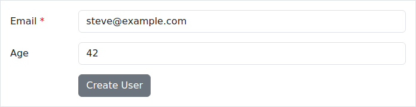
```erb
<%= bootstrap_form_for(@user) do |f| %>
  <%= f.email_field :email, floating: true %>
  <%= f.password_field :password, floating: true %>
  <%= f.password_field :password, floating: true %>
  <%= f.select :status, [["Active", 1], ["Inactive", 2]], include_blank: "Select a value", floating: true %>
  <%= f.submit "Log In" %>
<% end %>
```

This generates:

```html
<form accept-charset="UTF-8" action="/users" class="new_user" id="new_user" method="post">
  <div class="mb-3 form-floating">
    <input class="form-control" id="user_email" name="user[email]" placeholder="Email" type="email" value="steve@example.com">
    <label class="form-label required" for="user_email">Email</label>
  </div>
  <div class="mb-3 form-floating">
    <input class="form-control" id="user_password" name="user[password]" placeholder="Password" type="password">
    <label class="form-label" for="user_password">Password</label>
  </div>
  <div class="mb-3 form-floating">
    <input class="form-control" id="user_password" name="user[password]" placeholder="Password" type="password">
    <label class="form-label" for="user_password">Password</label>
  </div>
  <div class="mb-3 form-floating">
    <select class="form-select" id="user_status" name="user[status]">
      <option value="">Select a value</option>
      <option value="1">Active</option>
      <option value="2">Inactive</option>
    </select>
    <label class="form-label" for="user_status">Status</label>
  </div>
  <input class="btn btn-secondary" data-disable-with="Log In" name="commit" type="submit" value="Log In">
</form>
```

## Validation and Errors

Rails normally wraps fields with validation errors in a `div.field_with_errors`, but this behaviour isn't consistent with Bootstrap 4 styling. By default, `bootstrap_form` generations in-line errors which appear below the field. But it can also generate errors on the label, or not display any errors, leaving it up to you.

### Inline Errors

By default, fields that have validation errors will be outlined in red and the
error will be displayed below the field. Here's an example:

```html
<div class="mb-3">
  <label class="form-label form-control-label" for="user_email">Email</label>
  <input class="form-control is-invalid" id="user_email" name="user[email]" type="email" value="">
  <small class="invalid-feedback">can't be blank</small>
</div>
```

You can turn off inline errors for the entire form like this:

```erb
<%= bootstrap_form_for(@user, inline_errors: false) do |f| %>
  ...
<% end %>
```

### Label Errors

You can also display validation errors in the field's label; just turn
on the `:label_errors` option. Here's an example:

```erb
<%= bootstrap_form_for(@user, label_errors: true) do |f| %>
  ...
<% end %>
```

By default, turning on `:label_errors` will also turn off
`:inline_errors`. If you want both turned on, you can do that too:

```erb
<%= bootstrap_form_for(@user, label_errors: true, inline_errors: true) do |f| %>
  ...
<% end %>
```

### Alert Messages

To display an error message with an error summary, you can use the
`alert_message` helper. This won't output anything unless a model validation
has failed.


```erb
<%= bootstrap_form_for @user_with_error do |f| %>
  <%= f.alert_message "Please fix the errors below." %>
<% end %>
```

Which outputs:

```html
<form accept-charset="UTF-8" action="/users" class="new_user" id="new_user" method="post">
  <div class="alert alert-danger">
    <p>Please fix the errors below.</p>
    <ul class="rails-bootstrap-forms-error-summary">
      <li>Email is invalid</li>
      <li>Misc is invalid</li>
    </ul>
  </div>
</form>
```

You can turn off the error summary like this:

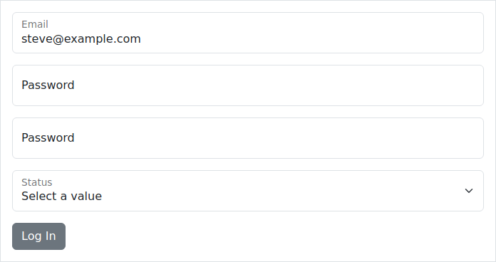
```erb
<%= bootstrap_form_for @user_with_error do |f| %>
  <%= f.alert_message "Please fix the errors below.", error_summary: false %>
<% end %>
```

This generates:

```html
<form accept-charset="UTF-8" action="/users" class="new_user" id="new_user" method="post">
  <div class="alert alert-danger">Please fix the errors below.</div>
</form>
```

To output a simple unordered list of errors, use the `error_summary` helper.

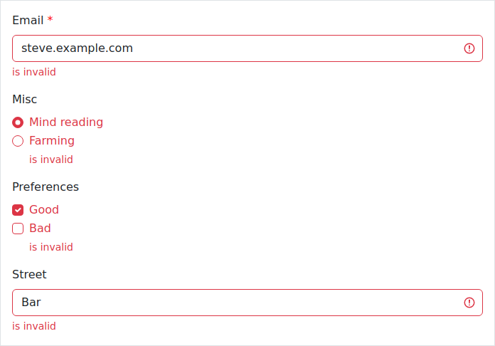
```erb
<%= bootstrap_form_for @user_with_error do |f| %>
  <%= f.error_summary %>
<% end %>
```

Which outputs:

```html
<form accept-charset="UTF-8" action="/users" class="new_user" id="new_user" method="post">
  <ul class="rails-bootstrap-forms-error-summary">
    <li>Email is invalid</li>
    <li>Misc is invalid</li>
  </ul>
</form>
```

### Errors On

If you want to display a custom inline error for a specific attribute not represented by a form field, use the `errors_on` helper.


```erb
<%= bootstrap_form_for @user_with_error do |f| %>
  <%= f.errors_on :email %>
<% end %>
```

Which outputs:

```html
<form accept-charset="UTF-8" action="/users" class="new_user" id="new_user" method="post">
  <div class="invalid-feedback">Email is invalid</div>
</form>
```

You can hide the attribute name like this:


```erb
<%= bootstrap_form_for @user_with_error do |f| %>
  <%= f.errors_on :email, hide_attribute_name: true %>
<% end %>
```

Which outputs:

```html
<form accept-charset="UTF-8" action="/users" class="new_user" id="new_user" method="post">
  <div class="invalid-feedback">is invalid</div>
</form>
```

You can also use a custom class for the wrapping div, like this:

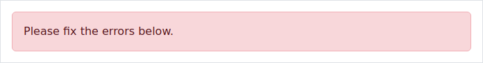
```erb
<%= bootstrap_form_for @user_with_error do |f| %>
  <%= f.errors_on :email, custom_class: 'custom-error' %>
<% end %>
```

Which outputs:

```html
<form accept-charset="UTF-8" action="/users" class="new_user" id="new_user" method="post">
  <div class="custom-error">Email is invalid</div>
</form>
```

## Required Fields

A label that is associated with a required field is automatically annotated with
a `required` CSS class. `bootstrap_form` doesn't provide any styling for required fields. You're free to add any appropriate CSS to style
required fields as desired. One example would be to automatically add an
asterisk to the end of the label:

```css
label.required:after {
  content:" *";
}
```

The label `required` class is determined based on the definition of a presence
validator with the associated model attribute. Presently this is one of:
ActiveRecord::Validations::PresenceValidator or
ActiveModel::Validations::PresenceValidator.

In cases where this behaviour is undesirable, use the `required` option to force the class to be present or absent:


```erb
<%= f.password_field :login, label: "New Username", required: true %>
<%= f.password_field :password, label: "New Password", required: false %>
```

This generates:

```html
<div class="mb-3">
  <label class="form-label required" for="user_login">New Username</label>
  <input class="form-control" id="user_login" name="user[login]" required="required" type="password">
</div>
<div class="mb-3">
  <label class="form-label" for="user_password">New Password</label>
  <input class="form-control" id="user_password" name="user[password]" type="password">
</div>
```

## Internationalization

bootstrap_form follows standard rails conventions so it's i18n-ready. See more
here: http://guides.rubyonrails.org/i18n.html#translations-for-active-record-models

## Future Compatibility

The Rails team has [suggested](https://github.com/rails/rails/issues/25197) that `form_for` and `form_tag` may be deprecated and then removed in future versions of Rails. `bootstrap_form` will continue to support `bootstrap_form_for` and `bootstrap_form_tag` as long as Rails supports `form_for` and `form_tag`.

## Other Tips and Edge Cases

By their very nature, forms are extremely diverse. It would be extremely difficult to provide a gem that could handle every need. Here are some tips for handling edge cases.

### Empty But Visible Labels

Some third party plug-ins require an empty but visible label on an input control. The `hide_label` option generates a label that won't appear on the screen, but it's considered invisible and therefore doesn't work with such a plug-in. An empty label (e.g. `""`) causes the underlying Rails helper to generate a label based on the field's attribute's name.

The solution is to use a zero-width character for the label, or some other "empty" HTML. For example:

```ruby
label: "&#8203;".html_safe
```

or

```ruby
label: "<span></span>".html_safe
```

## Contributing

We welcome contributions.
If you're considering contributing to bootstrap_form,
please review the [Contributing](/CONTRIBUTING.md)
document first.

## Previous Version

If you're looking for `bootstrap_form` for Bootstrap 4, go [here](https://github.com/bootstrap-ruby/bootstrap_form/tree/bootstrap-4).

## License

MIT License. Copyright 2012-2021 Stephen Potenza (https://github.com/potenza) and others
